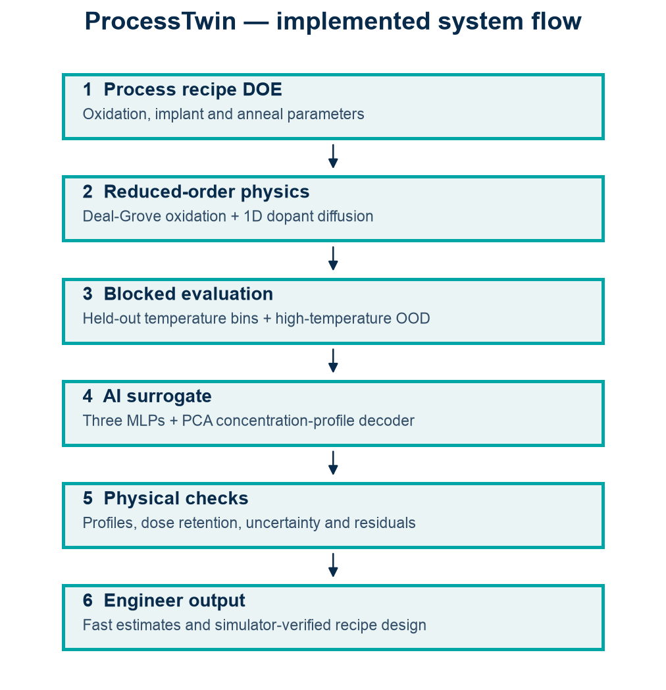

# ProcessTwin — Physics-Grounded AI for Silicon Thermal Processing

ProcessTwin combines transparent reduced-order process physics with an AI surrogate for silicon oxidation and dopant diffusion. It predicts oxide thickness, full concentration profiles, junction depth, and uncertainty from a process recipe, and verifies inverse-designed recipes in the physics simulator.

This is an educational research prototype, not commercial process software or fab-calibrated process prediction.



## Dataset at a glance

The saved [`data/simulated.npz`](data/simulated.npz) contains **6,000 synthetic process recipes**, generated locally by the reduced-order oxidation/diffusion simulator—not measurements from a fab. One example combines process settings (temperatures, times, wet/dry ambient, dopant species, dose and implantation/background parameters) with simulated oxide thickness, junction depth, peak concentration and a **121-point concentration-versus-depth profile**. The file stores recipe/target records, log-concentration profiles and their shared depth grid.

| Partition | Recipes | Purpose |
|---|---:|---|
| Training | 4,105 | Fit the surrogate |
| Validation | 458 | Model selection |
| Test | 477 | Held-out temperature-bin evaluation |
| High-temperature OOD | 960 | Check behaviour outside the training anneal-temperature range |

Validation/test assignments hold out complete 25°C anneal-temperature bins; OOD recipes use annealing temperatures of 1,055–1,150°C. These counts describe the saved run, not independent physical wafers. See [`src/processtwin/data.py`](src/processtwin/data.py) for generation and splitting.

## Technical snapshot

| Question | Implementation |
|---|---|
| What is being approximated? | A declared reduced-order simulator for silicon oxidation and 1D dopant diffusion |
| What does the model predict? | Oxide thickness, junction depth, peak concentration, and the full depth profile |
| How is the profile represented? | PCA coefficients reconstructed into a concentration profile |
| How is model disagreement exposed? | An uncalibrated dispersion band from three residual MLP members plus an OOD warning |
| How is inverse design checked? | Candidate recipes are rerun through the physics simulator before being reported |

### Held-out simulator-fidelity result

| Target | Interpolation R² |
|---|---:|
| Oxide thickness | 0.9968 |
| Junction depth | 0.9985 |

These values measure fidelity to the declared simulator on the saved held-out split. They are not evidence of accuracy against fabricated wafers.

The complete saved evaluation is in [`outputs/metrics.json`](outputs/metrics.json). Two results are especially important for interpretation:

- The surrogate took 17.17 μs/recipe versus 11.32 μs/recipe for the simple physics solver on the interpolation test (0.66× measured speedup), so this experiment does **not** establish general acceleration over the reduced-order simulator. On the saved OOD set, the measured ratio was 3.40×.
- The nominal 90% three-member ensemble bands covered 79.9% of oxide, 77.8% of junction, and 86.2% of peak targets on the test split, with lower coverage on OOD data. They are therefore reported as uncalibrated model-disagreement bands, not calibrated predictive intervals.

## Implemented

- Deal-Grove thermal oxidation with temperature-dependent coefficients
- Arrhenius boron/phosphorus diffusivity and dose-conserving 1D Gaussian broadening
- Deterministic 6,000-recipe simulated DOE with blocked interpolation and high-temperature OOD sets
- Polynomial ridge/PCA baseline and three-member residual MLP/PCA ensemble
- Oxide, junction, peak-concentration and full-profile metrics
- Ensemble disagreement bands, OOD warning, and simulator-verified inverse recipe design
- Streamlit process explorer, tests, saved artifacts, DOCX/PDF report

## Quick start — macOS/Linux

```bash
python3 -m venv .venv
source .venv/bin/activate
python -m pip install -r requirements.txt
python scripts/generate_data.py --samples 6000
python scripts/train.py
python scripts/evaluate.py
python scripts/inverse_design.py
streamlit run app.py
```

## Quick start — Windows PowerShell

```powershell
py -3.12 -m venv .venv
.\.venv\Scripts\Activate.ps1
python -m pip install -r requirements.txt
python scripts/generate_data.py --samples 6000
python scripts/train.py
python scripts/evaluate.py
python scripts/inverse_design.py
streamlit run app.py
```

## Outputs

- `data/simulated.npz`: recipes, profiles, split labels and depth grid
- `artifacts/surrogate.joblib`: baseline, PCA and three MLP ensemble members
- `outputs/metrics.json`: measured interpolation and OOD results
- `outputs/inverse_design.json`: simulator-verified inverse design example
- `outputs/processtwin_report.docx` and `.pdf`: presentation-ready technical report

## Repository map

```text
app.py                 Streamlit process explorer
src/processtwin/       Physics, data generation, and surrogate modules
scripts/               Generate, train, evaluate, invert, and report workflows
tests/                 Physics invariants and model tests
data/                  Reproducible simulated DOE
artifacts/             Saved surrogate pipeline
outputs/               Metrics, figures, inverse-design example, and report
```

## Scientific scope

Ground truth is generated locally from simplified continuum models and literature-scale coefficients. The simulator omits geometry effects, segregation, clustering, transient-enhanced diffusion, implant damage, stress, equipment variation, and fab calibration. Quantitative results establish surrogate fidelity to this declared simulator only.

The inverse-design example is verified against the same simplified solver that generated the training targets. It demonstrates numerical search and simulator consistency; it does not establish physical recipe validity, uniqueness, manufacturability, or transfer to a fabrication process.

## Artifact safety

`artifacts/surrogate.joblib` is provided for reproducibility. Python pickle/joblib files can execute code while loading; only load the bundled artifact from a trusted checkout, and never load an untrusted replacement.

## Tests

```bash
python -m pytest -q
```

Code and documentation are MIT licensed. Literature coefficients remain attributed to their original sources; see the report.
